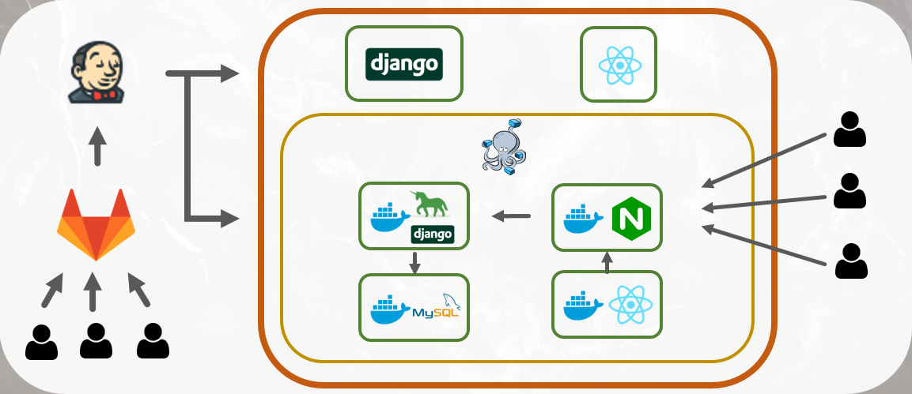

# 

> Dodge Angle by 일반인친구들

## ✏️ 사용법

> http://j3a504.p.ssafy.io/

## 소개영상

> https://youtu.be/Q9cKjzQ3jZc

### 1. PreEnterPage

- 예시 데이터

```
섭섭한면상님이 로비에 참가하셨습니다.
Keep oaring KR님이 로비에 참가하셨습니다.
쑤 택님이 로비에 참가하셨습니다.
옆집에사는뽀로로님이 로비에 참가하셨습니다.
모 까님이 로비에 참가하셨습니다.
```

- 팀원 리스트 생성
  - 위 예시 데이터를 입장 전 페이지의 `입력창` 에 넣고 `팀원 입력 완료`버튼 을 `클릭`
- 아군 픽 순서 변경
  - 생성된 팀원 리스트 내 `팀원 블럭` 을 `드래그`해서 원하는 순서에 `드랍`
  - 이때 팀원 블럭 간 `Swap`임에 유의
- 포지션 지정
  - 팀원 블럭 내 `포지션 이미지`를 `클릭` 해서 포지션 지정
  -
- "본인"을 지정
  - 팀원 배치가 완료되면 `팀원 배치 완료` 버튼을 클릭 하면 "본인"을 지정하는 모달 창이 팝업
  - "본인"에 해당하는 블럭을 `클릭`하여 "본인"을 지정
- `밴픽화면으로 이동`버튼을 클릭하여 이동

### 2. MainPage

- 챔피언 검색 & 포지션별 보기
  - 화면 중앙 상단의 `입력창`에 이름으로 검색
  - `포지션`버튼을 클릭하여 포지션별 챔피언 리스트만 보기 가능
- (밴픽공통) 챔피언 선택
  - `챔피언 이미지` `클릭`시 10명의 유저와 각각 매치되는 `픽`버튼 팝업
  - 해당하는 `픽`버튼 `클릭` 시 선택된 챔피언을 해당 유저에게 지정
- 페이즈 변경
  - 초기 페이즈는 `벤`
  - 벤 완료후 중앙의 `벤 완료` 버튼을 클릭 시, alert 창이 팝업되고 `확인`버튼을 누르면 `픽` 페이즈로 변경
  - 픽 완료후 중앙의 `픽 완료` 버튼을 클릭 시, alert 창이 팝업되고 `확인`버튼을 누르면 `완료` 페이즈로 변경

## 📆 프로젝트 개요

- **진행기간** : 2020.08.31 ~ 2020.10.08
- **목표**

  - 손 대면 톡~ 하고 트롤할 것 같은 그대~를 피하고 싶은 유저,
  - 즐겜러들 사이에서 고통받고 싶지 않은 유저,
  - 상대 픽의 약점인 카운터픽을 찾아 승리를 쟁취하고 싶은 유저 ,
  - 팀의 부족한 점을 채워주는 픽을 통해 승리에 기여하고 싶은 유저,
  - 이 모든 브실골 유저들을 위한 웹사이트 만들기

- **웹사이트 이름** : Dodge Angle (닷지각)

## 📖 주요 기능

#### 닷지각

- 해당 게임을 진행할지 닷지할지 추천

#### 승률예측

- 아군 유저의 정보와 챔피언 픽을 활용하여 경기 승부 예측

#### 추천시스템

- 밴픽에 도움이 되는 여러 정보를 제공
  - 예상 픽
  - 카운터 픽
  - 추천 픽

## 🔧 주요 사용 기술 스택 및 프레임워크

### FrontEnd

- React.js
- Redux

### BackEnd

- Django
- MongoDB

- K-means clustring, Dimension reduction, Linear regression

### Infra

### 

## 🥕 팀원 소개

> 일반인친구들


박유은 : BackEnd


장현준 : FrontEnd


정명주 : BackEnd & Infra


조진환 : BackEnd


차영부 : FrontEnd

## ⚙️Install and Usage

### 1. FrontEnd

```bash
$ cd frontend
$ npm install
$ npm start
```

### 2. BackEnd

```bash
$ pip install -r requirements.txt
$ touch .env # riot token, django secret key 설정
$ python manage.py migrate
$ python manage.py runserver
```

## 🐰 추가 \_ Introduce BackEnd

### 1. 데이터 수집

> Riot API를 이용하여 특정 티어의 게임 데이터를 저장

1. 특정 티어의 유저리스트를 저장

```python
summoner_list = []
url = f'{base_url}/lol/league/v4/entries/RANKED_SOLO_5x5/{tier}/{division}'
res = requests.get(url, headers=headers, params=params)
summoner_list += res.json()
```

2. 저장된 유저의 accountId를 저장

   > ​ 게임 데이터를 조회하기 위해서는 인코딩된 accountId가 필요

```python
accountids = []
url = f'{base_url}/lol/summoner/v4/summoners/by-name/{summoner_raw_data[i]["summonerName"]}'
res = requests.get(url, headers=headers, params=params)
accountids.append(res.json()['accountId']
```

    3. accountId로 각 유저의 게임id를 저장

```python
game_ids = []
url = f'{base_url}/lol/match/v4/matchlists/by-account/{account_id}'
res = requests.get(url, headers=headers, params=params)
game_ids += res.json()
```

    4. 게임id를 이용해 게임 데이터를 저장

```python
game_data = []
url = f'{base_url}/lol/match/v4/matches/{m["gameId"]}'
res = requests.get(url, headers=headers, params=params)
game_data += res.json()
```

### 2. 데이터 전처리

> 방대한 데이터를 pandas를 이용해서 필요한 데이터만 추출한 뒤 저장

### 3. 데이터 분석

> 각종 분석 방법을 사용하여 데이터를 분석

1. 트롤지수: 팀원전적조회

   - 소환사의 최근 전적에서 kda, 데미지(dpm), 골드(gpm)를 고려하여, 현재 티어 중 상위 몇%에 위치하는 지를 나타냅니다.

   - 기술적으로는 머신러닝 중 차원축소(dimension reduction) 기술과 정규분포의 확률밀도함수를 활용했다.

2. 승률예측

   - 챔피언 조합에 따른 아군과 적군 조합의 승률을 예측
   - 모든 챔피언의 Damage per gold와 KDA를 이용하여 K-Means 클러스터링을 통해 3개의 카데고리로 분류
   - 챔피언 조합의 승률을 예측하여 아군과 적군 조합의 승률을 알려줍니다.

3. 닷지각

   - 닷지각 = 트롤지수\*0.7 + (적 조합승률 - 아군 조합승률)\*0.3

   - 챔프 픽에 따라 닷지각을 변경되지만 챔프조합보다는 유저의 실력이 승패에 더 큰 영향을 미치기 때문에 트롤지수 가중치를 더 높게 설정

   - 아군의 최근전적과 전체 챔피언 조합을 고려하여 패널티를 감수하더라도 게임을 포기할 지 분석합니다.

4. 카운터 챔피언 추천 :

   - 라인전 지표를 10-20분의 골드 획득량 승부

   - **골드 획득량을 지표로 하여 해당챔피언과의 초반 라인 대전시 우세한 챔피언들을 보여줍니다**

5. 룬추천

   - 유저들 데이터 기반 최다 사용 룬

   - **현재 골드 티어의 메타를 분석한 인기 룬을 추천합니다**

6. 챔피언 추천

   - Collaborative filtering(memory based)을 기반으로 자신이 자주하는 챔피언과 유사한 챔피언을 추천합니다.

   - 랭크게임 데이터가 없는 경우, 현재 OP 챔피언 중 추천 (승률, 밴&픽률 기반)

7. 모스트 챔피언 (+승률)

   - 소환사의 최근 전적 기준 최다 플레이 챔피언 및 승률을 나타냅니다

### 4. API 구축

> Django를 이용한 restful API 구축

- Django settings.py

```python
INSTALLED_APPS = [
    'django.contrib.admin',
    'django.contrib.auth',
    'django.contrib.contenttypes',
    'django.contrib.sessions',
    'django.contrib.messages',
    'django.contrib.staticfiles',

    'corsheaders',
    # DRF
    'rest_framework',
    # Swagger
    'drf_yasg',
    # apps
    'champion',
    'summoner',
]
```

- MongoDB 설정

```python
DATABASES = {
    'default': {
        'ENGINE': 'djongo',
        'NAME' : 'normal',
        'CLIENT': {
            'host': config('MONGO_INITDB_ROOT_HOST'),
            'port': 27017,
            'username': config('MONGO_INITDB_ROOT_USERNAME'),
            'password': config('MONGO_INITDB_ROOT_PASSWORD'),
        },
    }
}
```
